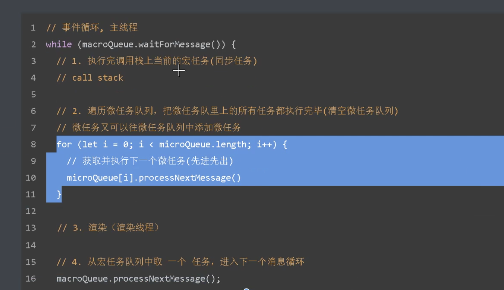

# 笔记

<!-- TOC -->

- [js异步编程](#js异步编程)
- [EventLoop（事件循环） 和 消息队列](#eventloop事件循环-和-消息队列)
  - [事件循环](#事件循环)
  - [消息队列](#消息队列)
- [宏任务和微任务](#宏任务和微任务)
  - [产生宏任务方式](#产生宏任务方式)
  - [产生微任务方式](#产生微任务方式)
  - [何时使用微任务](#何时使用微任务)
- [如何理解js是单线程的](#如何理解js是单线程的)
- [如何理解同步和异步](#如何理解同步和异步)
- [为什么await后续的代码是在微任务中执行，原理是什么](#为什么await后续的代码是在微任务中执行原理是什么)

<!-- /TOC -->

## js异步编程

js设计的初衷是处理用户在浏览器中的交互操作，即操作dom
如果同一个时间，存在两个操作处理同一个dom元素，浏览器是无法判断执行哪个操作的，所以执行js的线程被设计为单线程，但同时又引发了另外一个问题，当代码中有较复杂的计算需要消耗较长的时间时，js代码的执行就会被阻塞

所以出现了js异步编程的方式，当代码执行到异步相关逻辑时，如setTimeout、ajax。代码会继续向下执行，不会被阻塞，传一个callback给异步代码，像是在告诉代码：我继续往下执行了，不等你了，等你setTimeout走完，或者ajax请求到数据之后，执行我给你回调函数就好

如果没有异步模式，js语言就无法同时处理大量耗时任务

异步代码执行顺序不好理解

## EventLoop（事件循环） 和 消息队列

### 事件循环

EventLoop 是执行js事件（用户事件、非用户事件）执行的策略，可以理解为执行任务的一个循环，大致顺序如下：

- 取一个宏任务（script标签中的代码也是一个宏任务）放入Callstack(调用栈)中执行
- 当遇到宏任务时，将任务放入宏任务队列
- 当遇到微任务时，将任务放入微任务队列
- 当调用栈中的代码执行完毕后，清空微任务队列，如果微任务中还有微任务，也会在本轮中同时执行，然后执行必要的渲染和绘制操作
- 从宏任务队列中，取出第一个宏任务执行，如此循环往返
- .....

### 消息队列

消息队列相当于js待办的任务列表，当调用栈中任务执行完毕后，会从消息队列中取一个任务放入调用栈去执行

## 宏任务和微任务

js线程遇到同步和异步代码时的执行策略。js线程执行默认会从上往下执行js代码，当遇到异步代码时，会按照一定的时机，将其放入调用栈中

### 产生宏任务方式

1. setTimeout
2. setInterval
3. setImmediate 仅在IE和node中支持
4. 注册事件

### 产生微任务方式

1. Promise中的then
2. queueMicroTask
3. MutationObserver 监听DOM元素

### 何时使用微任务

1. 减少操作中用户可感知到的延迟

   为了操作dom后，尽快更新视图。因为清空微任务队列后，会立即渲染视图

2. 确保任务顺序的一致性，即便当结果或者数据是同步可用的

   在做浏览器数据缓存的场景中，我们经常将一些临时的数据缓存在内容中，这样当使用这些数据时，无法加loading效果，因为数据时本地的，获取很快。在外面套一层微任务，模拟异步调用的效果。以达到更好的用户体验

## 如何理解js是单线程的

js的主线程是单线程，而浏览器不是单线程的

更具体说，通过js调用的部分浏览器的api并不是单线程的，如setTimeout倒计时器，内部就会有单独的线程去倒数，时间到了之后，将回调函数放入消息队列

我们说的单线程是执行代码的线程是单线程

有一些事情耗时必然是需要有人去等的，我们不会让js线程去等，让异步线程去执行任务，我们只需要将后续操作以回调的方式告知异步线程即可

## 如何理解同步和异步

同步或者异步并不是指我们写代码的方式，而是运行环境提供的api是以同步还是异步模式去工作的

## 为什么await后续的代码是在微任务中执行，原理是什么
