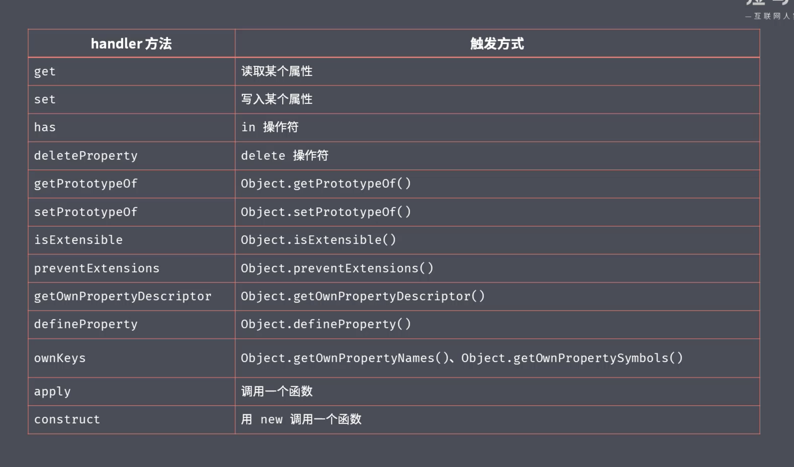

# ES 新特性与 TypeScript、JS 性能优化
<!-- TOC -->

- [ES 新特性](#es-新特性)
  - [字符串](#字符串)
    - [带标签的模板字符串](#带标签的模板字符串)
    - [扩展](#扩展)
  - [函数](#函数)
    - [参数默认值](#参数默认值)
    - [箭头函数](#箭头函数)
  - [... 扩展运算符和剩余运算符](#-扩展运算符和剩余运算符)
  - [对象](#对象)
    - [扩展](#扩展-1)
  - [proxy](#proxy)
  - [Reflect](#reflect)
    - [为什么要有Reflect](#为什么要有reflect)
  - [promise](#promise)
  - [class](#class)
  - [Set](#set)
  - [Map](#map)
  - [Symbol](#symbol)
    - [是什么](#是什么)
    - [为什么存在Symbol](#为什么存在symbol)
    - [使用场景](#使用场景)
  - [Bigint](#bigint)
  - [for of](#for-of)
  - [ECMAScript 2016 ES7](#ecmascript-2016-es7)
  - [ECMAScript 2017 ES8](#ecmascript-2017-es8)
- [TypeScript](#typescript)
- [性能优化](#性能优化)

<!-- /TOC -->
## ES 新特性

### 字符串

#### 带标签的模板字符串

```js

function myTag (strings, name) {
  const sex = name ? '1' : '2'
  return strings[1] + sex
}
const result = myTag`hey, my name is ${name}`
```

作用

- 对模板字符串进行加工，更适合用户的阅读

#### 扩展

- startWith
- endWith
- includes

### 函数

#### 参数默认值

- 使用短路运算符有缺陷，当参数传递false时，也会使用默认值
- 默认值设计的初衷是，当没有传递实参或者实参是undefined时，才会被使用
- 注意当参数是null时，是不会使用默认值的
- 有默认值的参数一定要传递在**参数列表**的最后，否则不起作用

```js
function foo (enable) {
  // 错误写法
  enable = enable || true

  // 正确写法
  enable = enable === undefined ? true : enable
}

// 更好的写法
function foo (enable = false) {}
```

#### 箭头函数

- 没有this，this在声明时确定，在箭头函数外面this是什么，里面this就是什么
- 代码中使用_this的情况都可以使用箭头函数代替

### ... 扩展运算符和剩余运算符

- ...[] 将数组转化成**参数列表**

### 对象

#### 扩展

- Object.assign()  浅拷贝，不会改变target对象引用地址
  应用场景：为option对象设置默认值
- Object.is

### proxy

- Number.isInteger 判断是否是数字
- throw new TypeError() 抛出类型错误



### Reflect

#### 为什么要有Reflect

以前操作对象，使用 in delete Object.keys, Reflect 统一了对象的操作方式

```js
Reflect.has(obj, 'name')
Reflect.deleteProperty(obj, 'age')
Reflect.ownKeys(obk)
```

### promise

### class

- 构造函数
- 属性
- 方法
- 静态方法 this指向构造函数
- extend 和 super

### Set

- add(1).add(2)
- size
- forEach for...of
- has(1)
- delete(1)
- clear()

### Map

- 与对象不同，Map键可以是其他类型
- 严格意义上的键值对集合
- set
- get

### Symbol

#### 是什么

- 是一个全新的基本类型数据
- 表示一个独一无二的值
- for in  Object.keys()  JSON.stringify 都获取不到symbol属性
- 使用 Object.getOwnPropertySymbols(obj) 可以获取到 symbol属性名

#### 为什么存在Symbol

- 扩展第三方模块时，扩展键，不能确定是否有冲突

#### 使用场景

- 为对象添加私有成员，外部无法拿到，只能通过对象对外暴露的方法获取
- 每次调用symbol都会产生一个全新的值，如果希望使用字符串产生唯一值，使用Symbol.for
- 提供了很多内置常量，用来当做内置方法如`toString`的标识

```js
Symbol('foo')
Symbol('person')

obj[Symbol()]

const obj = {
  [Symbol()]: 1
}

const s1 = Symbol.for('a')
const s2 = Symbol.for('a')
s1 === s2 // true

const obj = {
  [Symbol.toStringTag]: 'Xobj'
}
console.log(obj.toString())
```

### Bigint

用来储存更长的数字

### for of

- 遍历Array、Map、Set
- 实现了Iterator接口才可以被for of遍历

### ECMAScript 2016 ES7

- 数组的includes，indexOf没办法去寻找NaN
- 指数运算法 2 ** 10 === 1024

### ECMAScript 2017 ES8

- Object.values()
- Object.entries()
- padStart PadEnd **用给定的字符串去填充目标字符串的开始或者结束位置，直到达到目标长度位置**

## TypeScript

flow

- maybe类型 a: ?number  等价于  number | null | undefined
- mixed类型 等价于 any

## 性能优化
